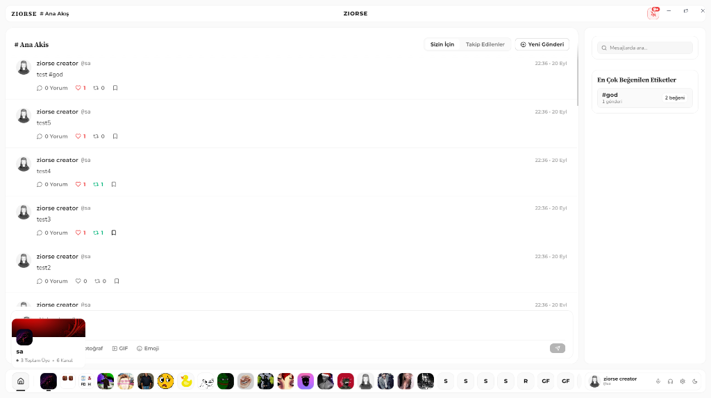
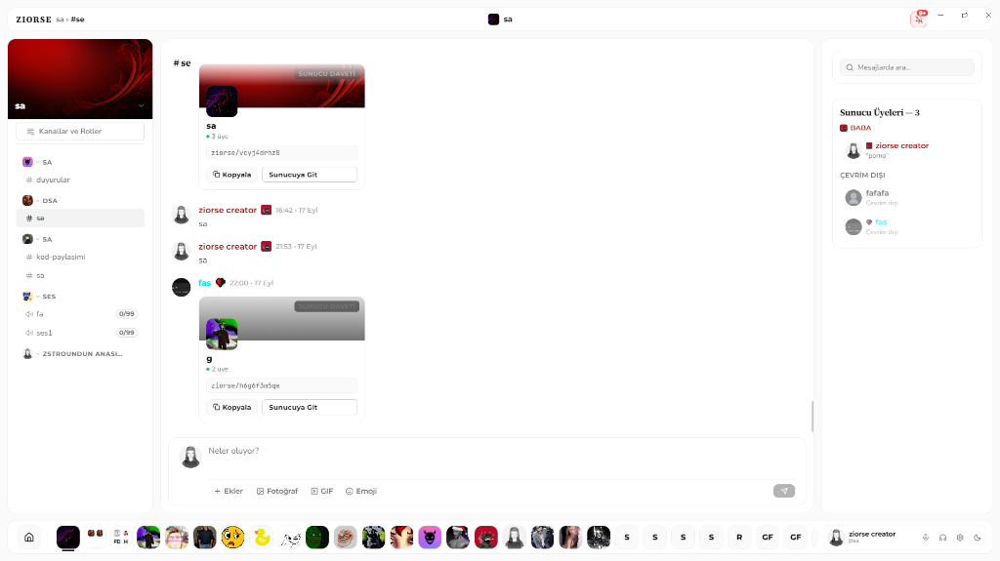
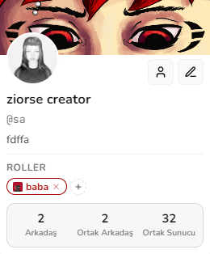

# Ziorse

> Ziorse - God's lonely app developer

Ziorse is an enterprise-grade desktop communication and social networking platform built with Electron, Node.js, and WebSocket architecture. It seamlessly bridges real-time microblogging, distributed server channels, low-latency voice communications, and direct messaging into a unified, high-performance desktop environment.

---

## Visual Overview

### Global Feed and Dynamic Timeline
The central feed enables real-time publication, engagement tracking (likes, reposts, threaded replies), and algorithmic trending hashtag discovery.



### Real-Time Server Channels and Communications
Servers feature organized channel categories, dedicated text and voice rooms, dynamic invite links with live member counters, and granular role hierarchies.



### User Identity and Profile Management
Rich profile cards showcase custom avatars, banners, biographical details, assigned roles, and relational metadata such as mutual friends and shared servers.

<p align="left">
  
</p>

---

## Core Capabilities

### 1. Global Feed and Discovery Engine
- Real-time post composition with multimedia support and link previews.
- Interactive engagement mechanisms: likes, retweets, bookmarks, and threaded discussions.
- Dynamic hashtag indexing with trending metrics calculated on the fly.
- Content filtering with dedicated feeds for global activity and followed accounts.

### 2. Community Servers and Voice Architecture
- Categorized text and voice channels supporting Web Audio API for crystal-clear sound processing.
- Role-based access control (RBAC) supporting custom titles, colors, and badge permissions.
- Live server invite cards with real-time member count synchronization across all clients.
- Interactive user status tracking (online, offline, custom status messages).

### 3. Direct Messaging and Scoped Mentions
- Low-latency one-on-one private messaging sessions.
- Scoped user mentions: in private conversations, mention autocomplete strictly confines suggestions to the active recipient, the current user, and broadcast mentions.
- Instant read receipts and typing feedback.

### 4. High-Efficiency Storage Engine
- 1,000-message chunked persistence system storing records in serialized format within dedicated partitions.
- Zero-latency RAM synchronization via synchronous Electron IPC, preventing UI freezes during high-volume reads and writes.
- Debounced background flushing to avoid unnecessary disk I/O.
- Automatic legacy migration for seamless updates without data loss.

### 5. Instant Continuous Synchronization
- Integrated file-system watcher that monitors codebase and design changes.
- Automated debounce clustering that stages, commits, and pushes updates directly to the remote repository.
- Dedicated background worker lifecycle managed cleanly alongside the primary Electron process.

---

## Technology Stack

| Layer | Technologies |
| :--- | :--- |
| **Desktop Shell** | Electron, Node.js child process management |
| **User Interface** | HTML5, Vanilla CSS3 (custom dark/light design system), ES6+ JavaScript |
| **Audio Processing** | Web Audio API, Native Audio Engine Bridge |
| **Networking & Real-Time** | WebSockets (Socket.IO), Express HTTP API, REST endpoints |
| **Storage Architecture** | Partitioned chunked database engine with in-memory caching |
| **Automation & Tooling** | Custom Git auto-sync daemon, Native C++ add-on integration |

---

## System Architecture

```
+-------------------------------------------------------------------+
|                           Electron Shell                          |
|  +--------------------+   IPC Bridge   +-----------------------+  |
|  |   Renderer Process | <------------> |      Main Process     |  |
|  |  (UI, DOM, Audio)  |                | (Window, Tray, Native)|  |
|  +--------------------+                +-----------------------+  |
|            |                                       |              |
+------------|---------------------------------------|--------------+
             | WebSocket                             | Child Process
             v                                       v
+------------------------+               +--------------------------+
| Express / Socket Server|               | GitHub Auto-Sync Daemon  |
| - Authentication       |               | - fs.watch continuous    |
| - Messaging & Rooms    |               | - Debounced commit/push  |
| - Dynamic Invites      |               +--------------------------+
+------------------------+
             |
             v
+-------------------------------------------------------------------+
|                   Partitioned File Storage                        |
|  /database_txt                                                    |
|  ├── /posts   (posts_chunk_0001.txt ... 1000 items/chunk)         |
|  ├── /dms     (dms_chunk_0001.txt ... 1000 items/chunk)           |
|  └── /system  (accounts, servers, user metadata)                  |
+-------------------------------------------------------------------+
```

---

## Installation and Setup

### Prerequisites
- Node.js (v18.0.0 or higher recommended)
- npm (v9.0.0 or higher)
- Git (configured with credentials for remote pushing)

### Setup Steps

1. **Clone the repository:**
   ```bash
   git clone https://github.com/xenpian/ziorse.git
   cd ziorse
   ```

2. **Install dependencies:**
   ```bash
   npm install
   ```

3. **Launch the application:**
   ```bash
   npm start
   ```
   This command starts the backend server, launches the Electron desktop application, and initiates the background synchronization daemon.

4. **Run the synchronization daemon independently (Optional):**
   ```bash
   npm run sync
   ```

---

## Project Structure

```
ziorse/
├── assets/                  # Application screenshots and visual documentation
│   ├── main-feed.png
│   ├── server-channels.png
│   └── user-profile.png
├── database_txt/            # High-throughput chunked storage engine
│   ├── dms/
│   ├── posts/
│   └── system/
├── scripts/                 # Automation scripts
│   └── github-auto-sync.js  # Continuous Git synchronization daemon
├── src/                     # Client application source
│   ├── css/                 # Design system and stylesheets
│   ├── js/                  # Client-side state and UI controllers
│   ├── sounds/              # Audio feedback assets
│   ├── index.html           # Primary application window
│   ├── login.html           # Authentication interface
│   └── register.html        # Account creation interface
├── main.js                  # Electron main entry point and IPC router
├── server.js                # WebSocket and HTTP backend server
├── preload.js               # Secure context isolation bridge
└── package.json             # Project configuration and script declarations
```

---

## Security and Data Integrity

- **Context Isolation:** The renderer process operates with `contextIsolation: true` and `nodeIntegration: false`, communicating exclusively via strictly defined IPC handlers in `preload.js`.
- **Atomic Operations:** File writes in the storage subsystem are validated and written sequentially to prevent race conditions and file corruption.
- **Credential Hygiene:** Local authentication tokens and keys are compartmentalized, ensuring individual account privacy on multi-user systems.

---

## License

This project is developed and maintained by **xenpian**. All rights reserved.
